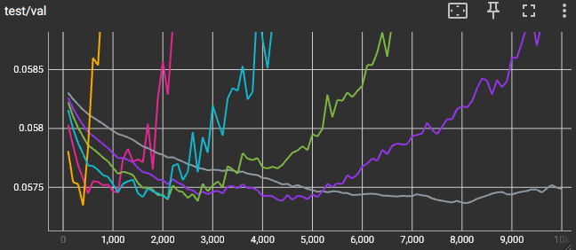

# demystifying-sd-finetuning

## Updates:

[I've created a basic utility for comfyui which measures loss across timesteps.](https://github.com/spacepxl/ComfyUI-LossTesting) It should work with any natively supported models by taking advantage of comfyui's abstractions for ksampler.

[Onetrainer now has a basic implementation of deterministic validation loss](https://github.com/Nerogar/OneTrainer/pull/660)

[Kohya sd-scripts has non-deterministic validation loss now, and deterministic is in progress](https://github.com/kohya-ss/sd-scripts/pull/1903)

[Musubi PR in progress](https://github.com/kohya-ss/musubi-tuner/pull/63)

## Introduction

Finetuning large pretrained diffusion models like Stable Diffusion (or flow models like Flux, SD3, etc) can be difficult, requiring a large amount of trial and error to get right. There are probably a thousand different videos and articles giving advice and tips by now, but most of them fit into the category of "here's what I found through trial and error, now copy my settings". This is hopefully a bit different. My aim here is to explain why it's such a hard problem to find clear answers, and how with the appropriate tools, you can find those answers for yourself much more easily. I'm going to use stable diffusion 1.5 for all the experiments here, but that's just for the sake of speed, and the same principles will apply to any diffusion/flow model.

## Training loss curves are noisy

If you've finetuned SD or trained a lora before, you've probably spent some time staring at something like this:


...and trying to look for meaning in it. Does it drop slightly over time, or is that just random movement? SHOULD you be able to see a pattern?

(spoiler: no)

In order to understand why this is so noisy, first we need to look at the training process itself. This is a simplified version of how sd1.5 is called during training:

```python
latents = vae_encode(pixels)
encoder_hidden_states = te_encode(captions)
timesteps = torch.randint(low=0, high=1000, (batch_size,))
noise = torch.randn_like(latents)
noisy_latents = noise_scheduler.add_noise(latents, noise, timesteps)
model_pred = unet(noisy_latents, timesteps, encoder_hidden_states)
loss = mse_loss(model_pred, noise)
```

There are two places where a random function is called. We sample a <ins>random timestep</ins> from the range of the model's noise schedule, and we sample <ins>random noise</ins> in the same shape as the encoded latent image. The noise is added to the latent, using the timestep to determine the strengh of the noise. We can think of the timestep as controling the *signal to noise ratio* (SNR) of the noisy_latents input, and in fact there's a [handy little utility in diffusers](https://github.com/huggingface/diffusers/blob/main/src/diffusers/training_utils.py#L60) that lets you calculate the SNR for any given timesteps.

What if, just as a test (NOT training the model), we sample each timestep in order (still using random noise though!), and graph the SNR and loss across the whole noise schedule?


Note that the Y axis is in logarithmic scale. At low timesteps, where the input is mostly image (high SNR), the model struggles to estimate the noise, with loss values nearing 1. At high timesteps, the SNR is low and the model input is mostly noise, which makes it easy for it to estimate the noise, and loss values are as low as 0.002

Isn't it interesting though, that the loss corresponds so smoothly with the timestep? There's still some noise, particularly towards the low SNR end, but overall it's very clean and predictable, especially considering that this still using *different random noise for each sample.* This tells us that most of the noise in our training loss curve is actually coming from the random timesteps, not the random latent noise.

We can fit a function to this and use it to flatten out the curve, so that the loss values are more similar across the schedule. The best fit I found in this case was an exponential function, and it's not perfect, but it does at least reduce the range somewhat:


Close enough at least that the range fits in one order of magnitude now, and is reasonably close to a normal distribution, instead of the wild exponential distribution we had before. If I log this debiased loss during an actual training run, it's still noisy, but it's a little easier to see a trend:


It's possible that a better equation could fit the loss curve better and cancel out more of the timestep noise, or we could potentially train a tiny neural network on the fly to fit it near perfectly. Ultimately though, it doesn't really matter that much, because this is only for visualization, and there's a much better option for that.

## Stable loss

Instead of trying to compensate for the timestep noise, why not just remove the randomness entirely? We could periodically evalute some fixed subset of images, using a fixed seed for any random functions, so that the same timesteps and the same noise are used every time. Credit to [/u/fpgaminer](https://old.reddit.com/r/StableDiffusion/comments/1gdkpqp/the_gory_details_of_finetuning_sdxl_for_40m/) for some of the code in my implementation. I'm not claming this is a new idea, but I think it's the missing ingredient that most people are overlooking.

How it works: every N steps, we pause training, store the random states, and manually seed to a fixed value. We can evaluate some number of images, average the loss across all of them, log it, then restore the old random states and continue training. See train_sd.py for specifics. I also went a bit further and added timestep buckets (for more uniform distribution across the noise schedule), to make the average as clean as possible. Now we have a deterministic loss value that gets logged over the training run, which we can use to judge how the model is learning:


This is what that stable loss curve looks like, evaluated on a test set of 2 images which are also in the training dataset. It's nice and clean, which is great, but it's basically a straight line, so what's going on? Is it just continuously improving? Should we keep going for more steps to find where it bottoms out?

## Dataset splits

There's a very important principle in machine learning: <ins>Split your dataset into training and validation subsets.</ins> Large neural networks can memorize a lot of data, so in order to evalute whether it's learning good general knowledge, or simply memorizing the specifics of the training data, you need to hold some portion of the data out from the training dataset.

To start with, I'm working with a very small dataset of 22 images, so I will just manually create my splits. I'm keeping 20 images in the training split, and holding out 2 for validation, and hand picking those two to be somewhat representative of the whole set. This is an extremely small dataset by ML standards, but it's a decent example for personalization training. Based on my observations, most people use something in the range of 5-50 images for training an identity model/lora. We'll come back to dataset size later.

Here's that same training run again, but this time with two stable loss curves - one for our test set which has images that are also in the training set, and one for the validation set which is held out from training:


See that U-shaped curve for validation? That's exactly what we're looking for. The decreasing validation loss means that the model is learning patterns that *generalize to images it has not trained on.* As the curve starts to rise again, that's where the model is learning patterns that are specific to the images in the training dataset, and don't generalize to the validation set, which is commonly known as overtraining. Note how by the end of this run, the validation loss is actually worse than at the start.

But...do we actually want to stop where validation loss is the lowest? If we were training on a huge dataset, probably. In this case where the goal is just to generate images that look good, maybe that's not ideal. It's possible that overtraining by some amount could actually improve the quality of generated images, at the expense of some flexibility or variety. But at least this gives a ruler to measure our progress, and it's very helpful for dialing in hyperparameters like learning rate, number of steps, etc.


Looking at a grid of samples from checkpoints along the training run, we can see that overtraining doesn't immediately hurt image quality. Instead it reaches good likeness around the minimum validation loss point at 2000 steps, then slowly starts to lose variety as it continues on. By the end, the variety of color and composition is severely reduced compared to the base model. In this case I would consider steps 2000-6000 to be usable, and I would probably test several checkpoints from that range more thoroughly with different prompts and experiment with merging them together.

## Learning Rate sweep

Lets's run a sweep of different learning rates, and compare the validation curves.



In order from highest to lowest LR, this is [5e-6, 1e-6, 5e-7, 3e-7, 2e-7, 1e-7]. We can see that learning rate does, as expected, have a mostly linear effect on the speed of convergence. More interesting though, it looks like all the runs reached a similar minimum validation loss, although the higher LR curves are more noisy. If you push the LR too high, it could eventually cause training instability, but below that threshold, this dataset didn't benefit from lowering the learning rate. With a larger dataset, you'll need a lower learning rate and more steps to get through all the images, but for a small dataset, maybe it doesn't matter? This went against my intuition, as I had previously belived that a lower learning rate for more steps would give a better result, but the numbers don't lie.

## Scaling LR vs Batch Size

The common advice I've seen is that when changing the batch size, you should scale the learning rate linearly with it. This behavior is written into every diffusers example training script, and many other training tools. Older theory stated that you should scale learning rate by the square root of the batch size to keep the variance constant, but about a decade ago it was found that for large batch sizes, it's better to scale linearly (https://arxiv.org/abs/1404.5997), and that seems to be the rule that has stuck around.

I'm scaling the logged step by the batch size, so that the curves line up based on the number of images sampled, for more convenient viewing.

Here's a series of runs with learning_rate * batch_size, for batch size in [1, 2, 4]:


And here's learning_rate * sqrt(batch_size):


Looks like in this case at least, with a UNet model and small batch sizes, the square root rule is more accurate. It's possible that other models might behave differently? Further testing is required. I don't know at what point you would start needing to scale linearly, but if you're training on a single GPU, square root is probably the way to go, and if you're using large enough batch sizes to start worrying about this, you should probably be running your own tests instead of blindly following some random guy on the internet :)

[From what I can find](https://github.com/CompVis/stable-diffusion/blob/main/Stable_Diffusion_v1_Model_Card.md), Stable Diffusion 1.5 was originally trained at a batch size of 2048 and a learning rate of 1e-4. If we divide `1e-4 / sqrt(2048)`, we get an upper bound of 2.2e-6 for a batch size of 1, which seems reasonable based on the results of the learning rate sweep. If we instead use linear scaling and divide `1e-4 / 2048`, that would give us a lower bound of 4.9e-8, which just seems unnecessarily low unless you have a massive dataset to get through.

This also shows that the batch size doesn't have much effect on the quality of the result when learning rate is scaled appropriately. I had expected that larger batch sizes might generalize better, but it seems that AdamW does just fine even at `batch_size = 1`. The main benefit of larger batch sizes then, is more efficient hardware utilization:

| batch size | steps |  time |      speed     |
| ---------- | ------| ----- | -------------- |
|      1     |  5000 | 34:23 | 2.4 images/sec |
|      2     |  2500 | 27:44 | 3.0 images/sec |
|      4     |  1250 | 23:54 | 3.5 images/sec |

## Seed

This one's simple enough, are some seeds better than others?


Nope, doesn't make any meaningful difference. Moving on...

## Text encoder training

Is it a good idea to train the text encoder(s)? Is it bad? Does it even matter? All of the major image diffusion models that I'm aware of use unmodified pretrained text encoders, rather than finetuning them in the context of image generation. Some community members believe that TE training can help, if done right, but it also seems that using too high a learning rate for the text encoder, or training it for too long, can cause it to collapse in some way. A common rule is to either use a lower learning rate for the text encoder compared to the diffusion model, or else stop training it after some number of steps. I tested training the text encoder for all steps, at different multipliers [1x, 0.5x, 0.25x] of the unet learning rate.


Very close results, although it does move the curves to the left slightly, probably just due to the increased number of trainable parameters. The minimum loss doesn't change meaningfully though, similar to with the learning rate sweeps. One way to think of it: if we consider the unet-only case as an example of `unet @ lr` and `te @ (lr * 0)`, we're effectively just increasing the average learning rate over the combination of both models. That left/right shift could lead people to falsely believe that enabling/disabling text encoder training helped or hurt, when really it just changed the number of training steps required for an equivalent result.

Worth noting that the captions for this dataset are probably in distribution for CLIP, so your results may vary. Most concepts will be in distribution already though, to be fair, since CLIP was trained on internet scale data. ([According to the paper,](https://arxiv.org/abs/2103.00020) they collect 400M image/text pairs based on searching for any word that appears in english wikipedia at least 100 times (500k total concepts), and approximately class balance by limiting each query to 20k results. No other forms of filtering.)

I suspect that if you want to add concepts that are actually new, not just new instances of an existing concept, it might be better to finetune CLIP with its original image encoder and contrastive loss, as that would allow it to actually learn the new concepts in their proper context rather than just treating the text encoder like an embedding layer. [Few people have even attempted real CLIP training though.](https://huggingface.co/zer0int)

## Lora

So far we've only been doing full parameter finetuning. Now, I'll use LoRA instead, using the PEFT library in the same way as diffusers example training scripts. Specifically, I'm only applying LoRA to the UNet since we already established that there was no benefit to training the text encoder. And to start with, I'm targeting only the attention layers, which is what diffusers and kohya do by default.

Right away, we have to adjust learning rate up compared to full parameter finetuning. We also have some new hyperparameters to consider: rank and alpha. Rank controls the size of the lora, or the number of parameters to add. Alpha is a scaling factor for the lora weights, ostensibly to help with numerical precision. However, because the lora weights are scaled by `alpha / rank` when applied to the model, the alpha also affects the speed at which the network learns, acting like a multiplier to the learning rate.

The common suggestions for alpha are either to leave it at 1, set it equal to rank, or else some multiple of rank, like rank / 2 or rank * 2. Here's a sweep of different alpha values while holding rank constant and adjusting learning rate to maintain the same convergence speed:


Square root scaling makes a return here. According to the authors of [the lycoris paper](https://arxiv.org/abs/2309.14859), when using Adam-like optimizers, if you divide alpha by k, you should multiply learning rate by sqrt(k). For SGD, you would multiply by k. I wasn't aware of this before, and only stumbled on into this knowledge after running these tests. Previously I had followed the often repeated rule of scaling by k, despite that being wrong for most commonly used optimizers. Interestingly though, it's not exactly sqrt(k), I had to bump the lr slightly higher (1.5e-4 instead of 1.1e-4) at alpha=1 to get the same convergence speed. Maybe something relating to weight decay or other optimizer parameters? Not sure.

Here's what happens if we change rank with alpha=rank and learning rate fixed:


Again, you can see that because we changed alpha, we would also need to adjust the learning rate to get the same convergence speed. If instead we set alpha to a constant value like 1, we can keep the same learning rate and change rank without affecting the convergence speed:


There doesn't seem to be any downside to keeping alpha=1, and it's much easier to deal with when changing rank, so that's what I'll stick with from this point on. 

We can see that lower ranks performed worse than higher ranks, which isn't surprising. More parameters means more capacity to learn, and more degrees of freedom, which makes it easier to optimize. However, even at rank=128 we still have a significant gap compared to full finetuning:


So far we've only been applying the lora to the attention weights ("to_k", "to_q", "to_v", "to_out.0", "add_k_proj", "add_v_proj"). Next, let's add in the MLP/feedforward layers, the other major part of the transformer blocks.


Looks like that closed the performance gap completely, at the cost of nearly doubling the trainable parameters. I also tested adding the resnet convolution layers, but that didn't improve any further, and it more than doubled the parameters again, so I'd say it wasn't worth it. At this point we could start experimenting with lower ranks and other variations like lycoris, dora, etc, but I'll leave it there for now.

## Optimizers

I'll return to full parameter UNet finetuning at this point for simplicity. Does optimizer choice affect the final result, or do they all converge to the same miminum?


Looks like AdamW is best, but AdamW8bit is free real estate. Equal performance with less memory used, and no need to change hyperparameters. Adafactor and SGD both required higher learning rates, and neither was able to hit AdamW's minimum. This was expected for Adafactor, but a bit surprising for SGD, which is known to reach higher classifier accuracy in some cases. SGD does use less memory, and is slightly faster in terms of it/s. Adafactor for some reason was less than half as fast as AdamW, not sure if that's expected or a bug.

What about weight decay? I've been using 1e-4 weight decay across the board so far, on the (probably false) assumption that the default 0.01 was meant for larger batch sizes.


The result at 0.1 was basically identical to 1e-4, and I had to go up to 10+ to see any effect. I think this might be more relevant for much longer training runs, but in this short term finetuning regime, you can leave it at default, or disable it entirely, it doesn't matter. Increasing weight decay was harmful across the board, and the same trend was true for SGD.

## Dataset

So far, we've seen that some things like optimizer choice and trainable parameters can hurt our minimum loss, but what if anything can actually improve it? The first knob to turn here is dataset size, and for that I'm going to experiment with a slightly larger dataset, with 270 images in the training set and 8 held out for validation. I'll run a series of smaller random subsets of the training set, so we can see if there's a benefit to training with more images. All runs are evaluated on the same validation set for consistency.


Hopefully this lays to rest any ideas of "less is more". Assuming the added images are of similar quality, adding more and training for longer does help. There's probably an explanation for all of this by thinking of the dataset as a limited sample of an underlying data distribution. In that way, it would make sense that more samples would lead to a better model of the true distribution, and thus generalize better to a different set of samples from that same distribution. But that's just my intuition, it's not something I claim to understand fully.

The step scaling here doesn't exactly line up with any consistent rule though. The smaller runs look like they're setting up nicely for square root scaling again, but then the full 270-image run goes and screws that all up:


It would be interesting to train on a very large number of datsets of many different sizes and establish an actual scaling law for this, but that's well outside the scope of this project.

The larger dataset also seems to contradict the earlier observation of higher learning rates not hurting loss:


What if we don't have more images though? Is there anything we can do to augment a smaller dataset to improve the performance?

Random cropping is well known to improve performance on vision models. We can apply it here, with some caveats. It won't work with latent preprocessing, since the latents need to be re-encoded for each new crop. And there's some risk of image-caption misalignment, because you could crop out something that's in the caption.


The results are pretty compelling, though. Adding random crop seems to simulate a larger dataset. We could add other augmentations as well, like horizontal flip (assuming the content isn't direction sensitive, like text for example), random color adjustments, etc.

To round things out, I trained a rank-128, attention+feedforward lora on the full dataset with random cropping. It beat the the full finetune without random crop, but fell short of the finetune with random crop. Something interesting also happened in the stable training loss, which I have no explanation for yet. Something for future investigation, maybe.


## Conclusion

What to take away from all of this? Well, I hope I've shed some light on some of the hidden dynamics at play behind finetuning, but above all, I would like to encourage the use of stable loss and validation splits. It could be implemented in a number of different ways, depending on personal preference, but none of them are particularly difficult. I hope this has shown why it's not just nice to have, but in fact *essential* for making informed decisions instead of guessing based on a few image samples and loss curves that are dominated by noise.

I'm including the two basic training scripts I used for this, one for finetuning and one for lora training. They're a bit rough around the edges, but the simplicity makes them easier to modify and experiment with. I'm also including all the tensorboard logs for anyone who wants to scrutinize them in more detail. Happy training!
